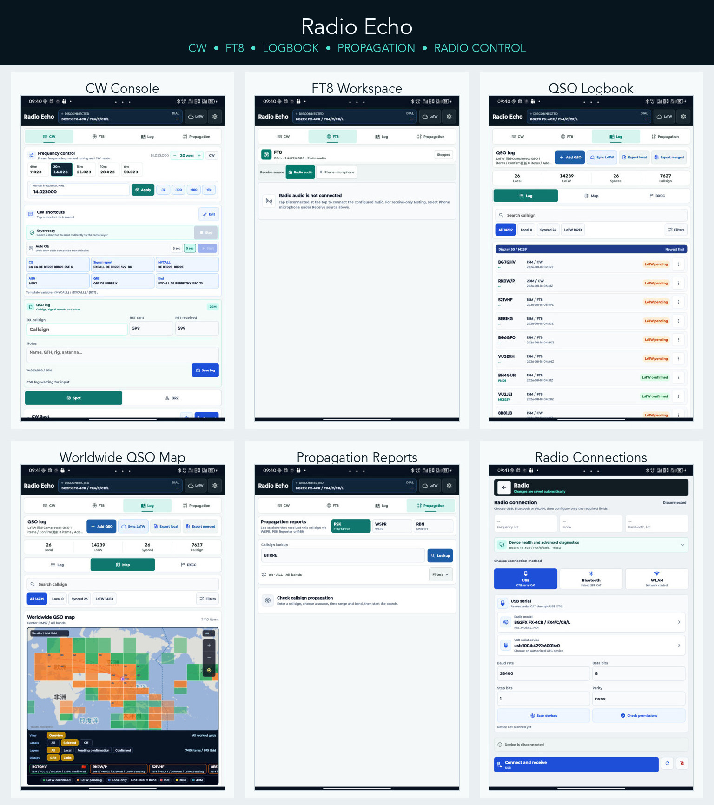

# Radio Echo

  <strong>English</strong> | <a href="README.zh-CN.md">简体中文</a>

**Radio Echo** is an Android amateur-radio companion independently developed and maintained by `BI1RRE`. It brings radio connectivity, CW operation, FT8, ADIF logging, LoTW synchronization and propagation reports to phones and tablets used for portable operation.

> This repository distributes official binary APK files, documentation and support materials. Radio Echo's proprietary source code is not published here. Free availability does not mean the application itself is released under an open-source license.

Radio Echo is designed as a lightweight field console, not as a replacement for mature desktop applications such as WSJT-X or JTDX.

## Feature Overview

- **Radio connectivity:** FX-4CR over Bluetooth SPP; Icom IC-705 over WLAN Remote and USB CI-V paths.
- **CW console:** frequency control, band presets, WPM adjustment, editable keying messages, DX Cluster/RBN spots and manual QSO logging.
- **FT8:** live spectrum, 15-second slots, lightweight decoding and manual or automatic QSO sequencing.
- **Logging:** local ADIF storage, search, editing, deletion, import/export and manual QSO entry.
- **LoTW:** history synchronization, confirmation status, certificate-based signing, reviewed upload queues and an opt-in FT8-only auto-upload policy.
- **Propagation:** PSK Reporter, WSPR and Reverse Beacon Network reports with map visualization.
- **Local-first operation:** Chinese and English UI, local settings backup and no Radio Echo cloud account.

> The interface collage reflects the current Radio Echo UI. The release notes for each APK remain authoritative.

## Download

Download [`Radio-Echo-v0.1.4-android-arm64.apk`](https://github.com/shidai-dev/RadioEcho/releases/download/v0.1.4/Radio-Echo-v0.1.4-android-arm64.apk) from the official [GitHub Releases](https://github.com/shidai-dev/RadioEcho/releases) page. The current build is a public preview and is marked as a **Pre-release**.

Official release files:

- `Radio-Echo-v0.1.4-android-arm64.apk`
- `SHA256SUMS.txt`
- `THIRD_PARTY_NOTICES.md`

Do not install repackaged copies from unofficial download sites, group storage or third-party mirrors.

## APK Information

| Item | Value |
| --- | --- |
| Application | Radio Echo |
| Version | 0.1.4 (versionCode 5) |
| Android package | `cn.bi1rre.radioradioecho` |
| Minimum Android | Android 7.0 / API 24 |
| Target Android | API 35 |
| CPU architecture | `arm64-v8a` |
| License state | Free preview, no trial countdown or activation code |
| FT8 backend | Lightweight MIT-licensed `ft8_lib` backend |

## Current Support Status

- **FX-4CR:** Bluetooth SPP CAT and CW keying. Links that do not return CAT data operate in control-only mode; USB CAT connection, frequency control and CW transmit have limited field evidence.
- **Icom IC-705:** Icom WLAN Remote and an experimental USB CI-V control path.
- **Yaesu FT-DX10:** USB Enhanced CAT plus Standard-port DTR CW keying has limited field verification and requires `PC KEYING=DTR` on the radio.
- **Experimental USB catalog:** protocol-backed Icom, Yaesu, Kenwood, Elecraft, Xiegu, QRP Labs, GUOHETEC and Wolf SDR entries; models without field evidence are clearly marked unverified.
- **CW:** preset keying, frequency control, WPM, manual QSO logging and DX Cluster spots.
- **FT8:** receive spectrum, slot timing, lightweight decoding and QSO sequencing.
- **Logs:** local ADIF, import/export, editing, deletion, LoTW history and reviewed upload; new FT8 QSOs can optionally auto-upload when explicitly enabled.
- **Propagation:** PSK Reporter, WSPR and Reverse Beacon data.
- **Updates:** opt-in daily GitHub Release checks and a manual check action; installation always remains user-confirmed.

Other radios, firmware versions, Android vendor systems and audio-routing combinations have not completed full compatibility acceptance testing. A listed implementation path does not guarantee that every hardware combination has passed field testing.

FT8 weak-signal performance, dense multi-signal conditions and continuous automatic sequencing remain active test areas and are not equivalent to WSJT-X or JTDX on a desktop computer.

## Installation and Upgrade

See [INSTALL.md](INSTALL.md) for complete installation instructions. Export the application configuration and full ADIF log before upgrading.

The earlier package name `cn.hyperft8.mobile` is different from the current package. Android does not automatically migrate private application data between them.

## Transmission Safety

Radio Echo does not grant an amateur-radio license, station authorization, callsign or regulatory permission. Before the first transmission, verify frequency, mode, PTT, audio level, ALC, output power and SWR in a controlled low-power environment. Always keep a physical method available to stop transmission immediately.

Automatic CQ, automatic replies and repeated transmission must remain under the supervision of the licensed operator. Stop transmitting immediately if the frequency is incorrect, bandwidth is abnormal, PTT does not release, the device disconnects, harmful interference occurs or the operating state is uncertain.

See the [Amateur Radio Compliance and Transmission Safety Notice](legal/RADIO_COMPLIANCE_NOTICE.zh-CN.md).

## Privacy and External Services

Radio Echo has no application account and no proprietary cloud log service. Logs, certificates, audio and radio settings are processed locally by default. The application connects directly to third-party services only when the user configures or invokes LoTW, QRZ, Tianditu, Telnet clusters, PSK Reporter, WSPR, RBN or a network-connected radio.

Never post LoTW, QRZ or Icom passwords, P12 files or passphrases, Tianditu API keys, full configuration backups or raw logs containing personal information in a public issue.

The full [User Service Agreement](legal/USER_SERVICE_AGREEMENT.zh-CN.md) and [Privacy Policy](legal/PRIVACY_POLICY.zh-CN.md) are currently provided in Chinese.

## Distribution and Licensing

This repository publishes the free Radio Echo binary preview and does not publish Radio Echo's proprietary source code. Users may download the official APK and install it on their own Android devices. Third-party components remain subject to their respective licenses.

See the [Binary Distribution License](LICENSE), [Binary Distribution Notice](BINARY_DISTRIBUTION_NOTICE.md) and [Third-Party Notices](THIRD_PARTY_NOTICES.md).

## Feedback and Support

- Use the repository's Bug Report template for ordinary defects.
- Send security reports or sensitive material to `BI1RRE@163.com`; do not publish them in an issue.
- Read [SUPPORT.md](SUPPORT.md) and [SECURITY.md](SECURITY.md) before submitting a report.

Radio Echo is maintained by an individual amateur-radio enthusiast in spare time. No service level, repair deadline or compatibility guarantee is provided.

**73, BI1RRE**
