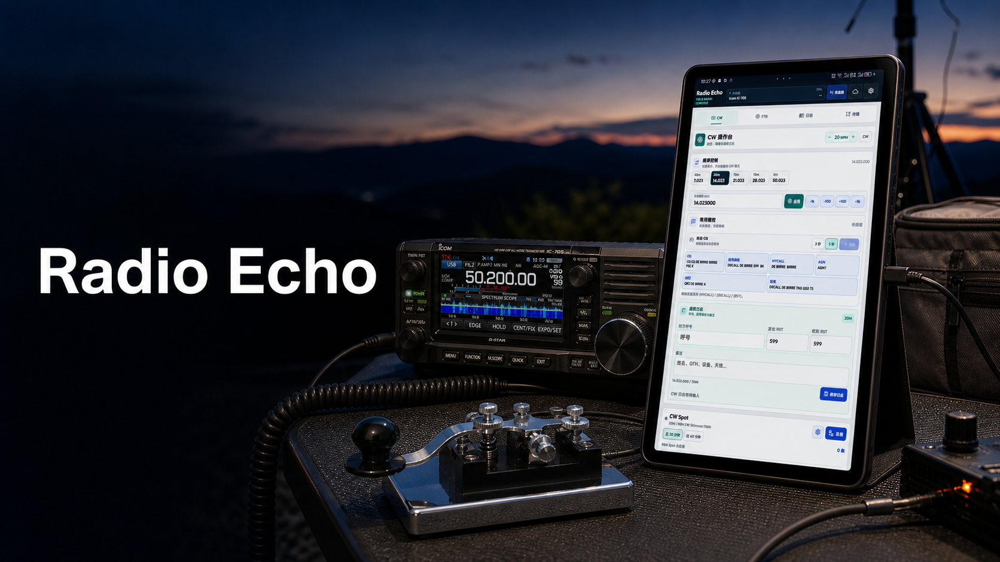
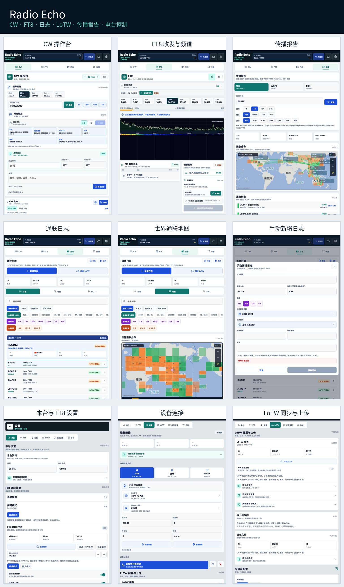

# Radio Echo

  <a href="README.md">English</a> | <strong>简体中文</strong>

**Radio Echo** 是由业余无线电爱好者 `BI1RRE` 独立开发维护的 Android 业余无线电辅助应用，为便携操作提供电台连接、CW、FT8、ADIF 日志、LoTW 同步和传播信息等功能。

> 当前仓库仅用于发布官方二进制 APK、使用文档和问题反馈，不提供 Radio Echo 自有源代码。免费使用不代表软件已按开源许可证发布。

Radio Echo 的定位是轻量化便携电台工作台，并不是为了取代 WSJT-X、JTDX 等成熟桌面软件。

## 功能概览

- **电台连接：** FX-4CR 蓝牙 SPP，以及 Icom IC-705 WLAN Remote 和 USB CI-V 路径。
- **CW 操作台：** 频率控制、波段预设、WPM 调整、可编辑拍发内容、DX Cluster/RBN Spot 和手动通联日志。
- **FT8：** 实时频谱、15 秒时隙、轻量解码以及手动或自动通联流程。
- **日志管理：** 本地 ADIF 保存、搜索、编辑、删除、导入导出和手动新增日志。
- **LoTW：** 历史同步、确认状态、证书签名、人工审核上传队列，以及可选的仅 FT8 自动上传策略。
- **传播查询：** PSK Reporter、WSPR、Reverse Beacon Network 和地图展示。
- **本地优先：** 中英文界面、本地配置备份，不要求注册 Radio Echo 云端账号。

> 界面拼图对应当前 Radio Echo 界面，实际功能仍以对应 Release Notes 为准。

## 下载

请从官方 [GitHub Releases](https://github.com/shidai-dev/RadioEcho/releases) 页面下载 [`Radio-Echo-v0.1.4-android-arm64.apk`](https://github.com/shidai-dev/RadioEcho/releases/download/v0.1.4/Radio-Echo-v0.1.4-android-arm64.apk)。当前版本为公开预览版，并标记为 **Pre-release**。

官方发布文件：

- `Radio-Echo-v0.1.4-android-arm64.apk`
- `SHA256SUMS.txt`
- `THIRD_PARTY_NOTICES.md`

不建议从第三方网盘、群文件、重新打包站点或非官方镜像下载安装。

## APK 信息

| 项目 | 内容 |
| --- | --- |
| 应用名称 | Radio Echo |
| 版本 | 0.1.4 (versionCode 5) |
| Android 包名 | `cn.bi1rre.radioradioecho` |
| 最低系统 | Android 7.0 / API 24 |
| 目标系统 | Android API 35 |
| CPU 架构 | `arm64-v8a` |
| 授权状态 | 免费测试版，无试用倒计时，无授权码 |
| FT8 后端 | MIT 许可的 `ft8_lib` 轻量后端 |

## 当前支持范围

- **FX-4CR：** Bluetooth SPP CAT 和 CW 键控；无 CAT 回包的链路会进入“仅控制”模式，USB CAT 连接、频率控制和 CW 发射已有有限真机证据。
- **Icom IC-705：** Icom WLAN Remote，以及实验性的 USB CI-V 控制路径。
- **Yaesu FT-DX10：** USB Enhanced CAT 与 Standard 口 DTR CW 键控已有有限真机验证，电台需设置 `PC KEYING=DTR`。
- **实验性 USB 目录：** 已接入具备协议实现的 Icom、Yaesu、Kenwood、Elecraft、Xiegu、QRP Labs、国合与 Wolf SDR 型号；没有真机证据的型号明确标记为待验证。
- **CW：** 快捷键控、频率控制、WPM、手动通联日志和 DX Cluster Spot。
- **FT8：** 接收频谱、时隙显示、轻量解码和通联流程。
- **日志：** 本地 ADIF、导入导出、编辑删除、LoTW 历史同步和人工审核上传；明确启用后可仅对新完成的 FT8 通联自动上传。
- **传播：** PSK Reporter、WSPR 和 Reverse Beacon 数据展示。
- **版本更新：** 可选的每日 GitHub Release 检查和手动检查入口，安装过程始终由用户确认。

其他电台、固件、Android 厂商系统和音频路由尚未完成全面兼容验收。兼容列表表示已有实现路径，不代表所有硬件组合都已通过实地测试。

FT8 弱信号能力、复杂多信号环境和连续自动通联仍是重点验证项目，不能等同于桌面环境中的 WSJT-X 或 JTDX。

## 安装与升级

完整步骤见 [INSTALL.md](INSTALL.md)。升级前请在应用内导出配置和完整 ADIF 日志。

早期包名 `cn.hyperft8.mobile` 与当前包名不同，Android 不会自动迁移两个应用之间的私有数据。

## 发射安全

Radio Echo 不授予业余无线电操作资格、台站执照、呼号或监管许可。首次发射前必须在低功率、可控环境核对频率、模式、PTT、音频、ALC、功率和驻波，并确保能够通过电台实体控件立即停止发射。

使用自动 CQ、自动应答或连续发射时，实际操作人必须持续监督。发生错误频率、异常带宽、PTT 无法释放、设备断连、有害干扰或状态不确定时，应立即停止发射。

详见 [业余无线电合规与发射安全声明](legal/RADIO_COMPLIANCE_NOTICE.zh-CN.md)。

## 隐私与联网服务

Radio Echo 不设应用账户和自有云端日志库。本地日志、证书、音频和设备配置默认在设备本机处理。只有在用户主动配置或使用 LoTW、QRZ、天地图、Telnet、PSK Reporter、WSPR、RBN 或网络电台时，应用才会直接连接对应第三方服务。

请勿在公开 Issue 中上传 LoTW、QRZ 或 Icom 密码，P12 文件或密码，天地图 API Key，完整配置备份以及包含个人信息的原始日志。

详见 [用户服务协议](legal/USER_SERVICE_AGREEMENT.zh-CN.md) 和 [隐私政策](legal/PRIVACY_POLICY.zh-CN.md)。

## 软件发行与许可

本仓库发布的是 Radio Echo 免费二进制测试版，不提供 Radio Echo 自有源代码。用户可从官方 Release 下载并安装到自己的 Android 设备。第三方组件继续适用各自许可证。

详见 [二进制发行许可](LICENSE)、[二进制发行声明](BINARY_DISTRIBUTION_NOTICE.md) 和 [第三方许可声明](THIRD_PARTY_NOTICES.md)。

## 反馈与支持

- 普通缺陷：使用仓库的 Bug Report 模板提交 Issue。
- 安全问题或敏感材料：发送邮件至 `BI1RRE@163.com`，请勿公开提交。
- 提交前请阅读 [SUPPORT.md](SUPPORT.md) 和 [SECURITY.md](SECURITY.md)。

本项目由个人业余无线电爱好者利用业余时间维护，不承诺服务等级、修复期限或对所有设备提供兼容保证。

**73，BI1RRE**
